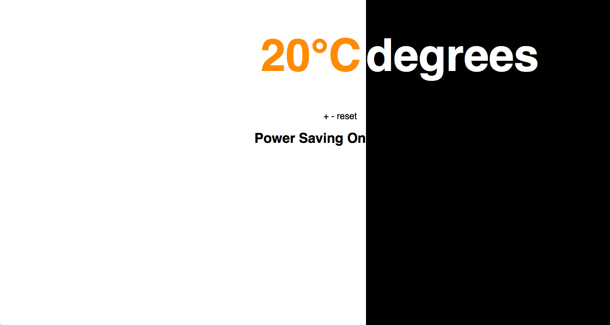

# Thermostat

This was second of the Week 5 projects at Makers Academy. The task was to create a thermostat UI in the browser.

##Pair Partner

[Huy Le](https://github.com/tekhuy)

##Learning Objectives

To start using jQuery and become more familiar with HTML and CSS.

##CRC/Domain Model

* The thermostat starts at 20 degrees
* You can increase the temperature with the up button
* You can decrease the temperature with the down button
* The minimum temperature is 10 degrees
* If power saving mode is on, the maximum temperature is 25 degrees
* If power saving mode is off, the maximum temperature is 32 degrees
* Power saving mode is on by default
* The temperature is reset to 20 by hitting the reset button
* The thermostat should color the display based on energy usage - < 18' is green, > 25' is red, otherwise yellow

##Issues Faced

We had a huge problem with the CSS that ended up taking most of the day to fix. As such, we didn't get nearly as far along with the front-end as we would have liked.

##Future Intentions

I would like to add a grid system, some images, and improve the buttons.
